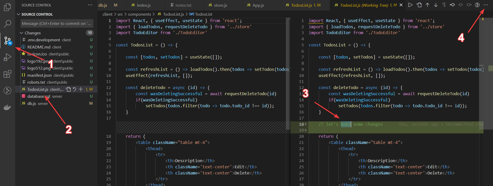

# 📓 Git Notes

## 💻 Useful Commands
- `git status --ignored` will show you what is being ignored.
- `git commit --amend -m "an updated commit message"` to update your latest commit message if you made a typo. You can also add additional files to a commit by adding them before running this command.
  - If you don't want to type a new commit message when adding files to a commit, you can do `git commit --amend --no-edit` to keep the previous commit message.
- `git status` will show a list of files that contain uncommitted changes. These files are grouped into two sections: uncommitted changes that have been staged (e.g., you've done `git add` on these) and uncommitted files that have not been staged. 💡 Tip: This command is super useful for spotting hidden files that sneak their way into commits if you don't have them ignored/your `.gitignore` set up yet (I'm looking at you `.DS_Store`).

## ✅ Commits

### The Point of Good Commits
- Documenting changes to the codebase: A bunch of diffs in a commit, assuming they're all contributing to the same thing (e.g., adding a new feature, fixing a particular bug) may not make it very clear what the commit accomplishes. A good commit message will label that set of code changes with a higher-level , human-readable summary (like "fixing this particular bug" or "adding this particular feature").
- Enabling collaboration: Your team (and your future self) can clearly see the who/what/where/why/when of changes that were made (the code that has been changed and the diff there shows the "how" 😃).
- Defining clear "save" points in the code: When something breaks, good commits make it easier to pinpoint what went wrong and to revert back to a stable state.
- Improving the development process: Thinking about your commits can help to structure your workflow and focus on a particular task.


### Information Anatomy of a Good Commit

A diff will show you what has changed in the codebase, and the commit message is what tells you why something has changed the way it has.

- Who: Who made this change to the code? Implicitly captured by git as the commit author.
- What: What files/lines of code were changed? Implicitly captured in the diff. All you need to do is make sure you group commits so that the right combo of files are grouped in a commit.
- Where: Where are the changes? Again, captured implicitly in the diff.
- When: When was the code changed. Implicitly captured by git as a timestamp.
- Why: Why did the code change this way? This is where your commit message comes in. Was this change a new feature outlined in JIRA-123? Does this fix a compilation bug? Etc.
- How: How was the code changed? Again, captured by the diff!

### The Structure of a Good Commit

```
  <type>(<scope>): <subject>
  <body>
  <footer>
```

I think the most important parts are the subject and body. I'm a big fan of type too. I haven't used footer, because the convention on my teams is to include Jira ticket numbers in the commit subject, and I also haven't used scope, which hasn't had an obvious use in my particular projects so far.


Example commit without a footer.
```
git commit -m "chore(server): JIRA-123 - Update routing dependencies in Node server

The previous version of the routing library in the Node server is not compatible with the latest OurCoolAPI changes."
```

Example commit with a footer.
```
git commit -m "chore(server): Update routing dependencies in Node server

The previous version of the routing library in the Node server is not compatible with the latest OurCoolAPI changes.

Resolves: JIRA-123
Related: PR #87, PR #86"
```

### Tools for Making Good Commits

To help make atomic commits, you can stage chunks of code -- you don't have to stage an entire file at once!<sup>[3](#references)</sup> in VS Code there's a way to visually select chunks to stage, as shown in the image below. You can also right click on the section of code you want to stage and an open will appear in the context menu for staging/un-staging the selected range.



From the command line, you can do this with the `git add --patch` and `git add --interactive` for interactive modes.<sup>[4](#references)</sup>

### Other Resources For Good Commits

- [Gitmoji](https://gitmoji.dev/): An emoji guide for git commits. They're fun and can help you make better commits. Also see my [customized git commit emoji cheatsheet](git-commit-emoji.md).
- [Angular's configuration of commitlint](https://github.com/conventional-changelog/commitlint/tree/master/@commitlint/config-conventional#type-enum): Shows examples of categories of conventional git commit messages to help you make more sensible commits.
- [Karma commit style](https://karma-runner.github.io/0.10/dev/git-commit-msg.html): Shows examples of conventional commits.

## 🛠️ Tools
- [commitlint](https://github.com/conventional-changelog/commitlint): Linting for your commits.
- [github/gitignore](https://github.com/github/gitignore): A collection of useful `.gitignore` templates.

## 💡 Tips
- Keep a `commits.md` file handy as a kind of "scratch paper" where you can write out commits so you can paste them into your terminal. This can make it easier to make sure your commit message is formatted properly, especially if you have more than just a one-line commit title.

## 📙 Resources
- [Git Better](https://gitbetter.substack.com/): A newsletter about git tips.

## 📚 References
- [1] [Comparing Workflows](https://www.atlassian.com/git/tutorials/comparing-workflows)
- [2] [A successful Git branching model](https://nvie.com/posts/a-successful-git-branching-model/)
- [3] [How can I commit some changes to a file, but not others, in VSCode?](https://stackoverflow.com/questions/34730585/how-can-i-commit-some-changes-to-a-file-but-not-others-in-vscode)
- [4] [git add --patch and --interactive](https://nuclearsquid.com/writings/git-add/)
- [5] [How to Use a .gitignore File](https://www.pluralsight.com/guides/how-to-use-gitignore-file)
- [6] [Developer Tip: Keep Your Commits “Atomic”](https://www.freshconsulting.com/insights/blog/atomic-commits/)
- [7] [How to Write a Git Commit Message](https://chris.beams.io/posts/git-commit/)
- [8] [Git is my buddy: Effective Git as a solo developer](https://mikkel.ca/blog/git-is-my-buddy-effective-solo-developer/)
